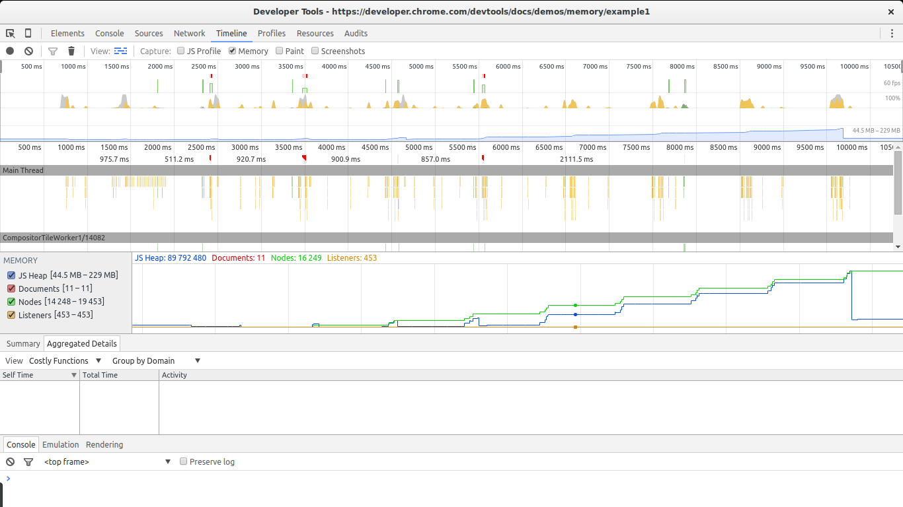
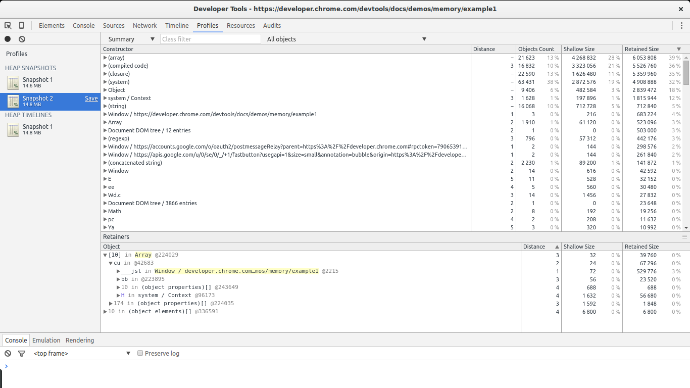
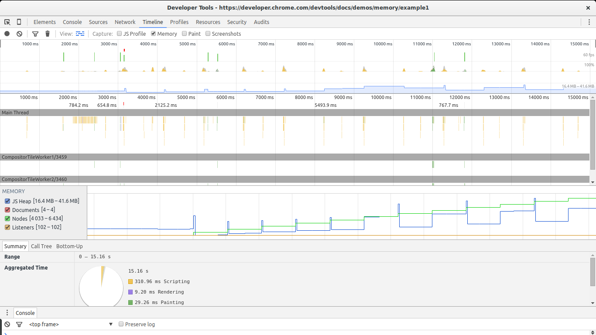
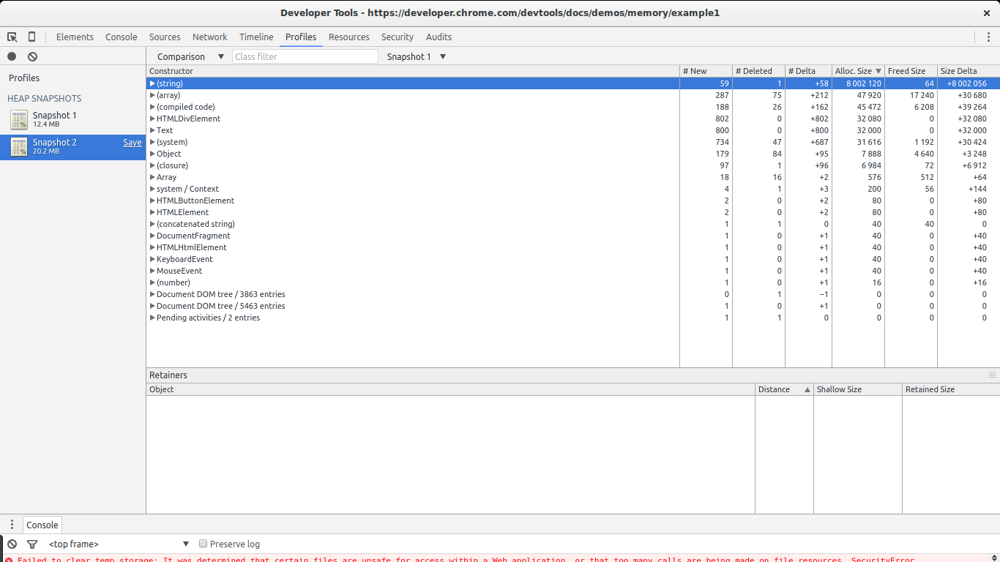
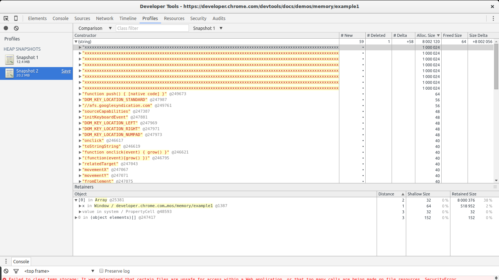
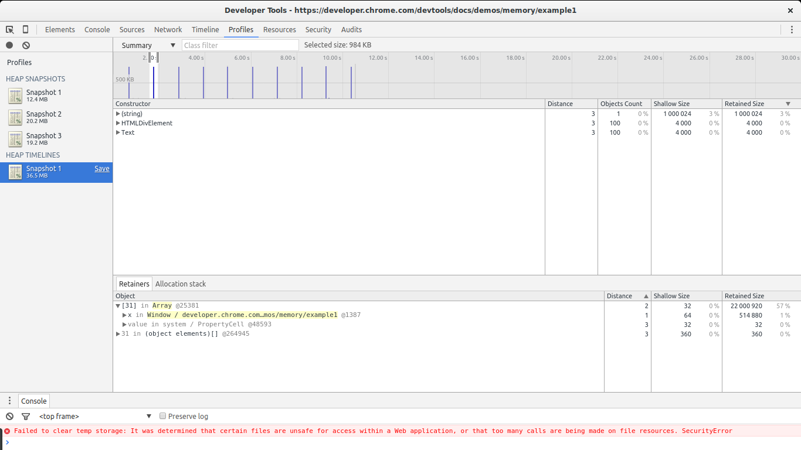
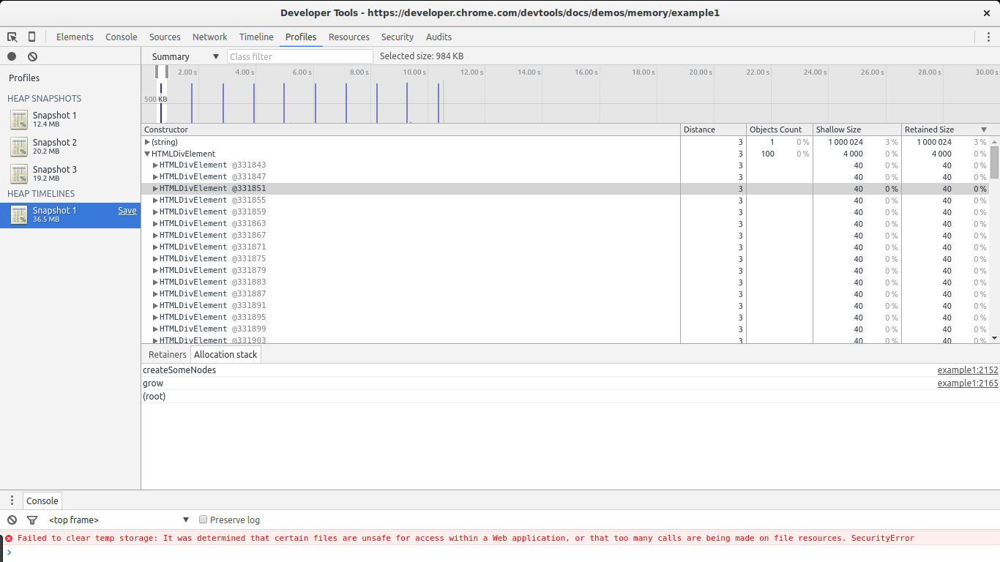

# 4 вида утечек памяти в JavaScript и как с ними бороться

В этой статье мы рассмотрим распространённые виды утечек памяти в клиентском JavaScript. Также мы узнаем, как их обнаружить с помощью Chrome Development Tools.

---

_Примечание переводчика:_ первая часть статьи насыщена примечаниями переводчика. В ходе анализа материала стало понятно, что некоторые моменты стоит отдельно пояснить.

## Вступление

Утечки памяти принадлежат к тому роду задач, с которыми рано или поздно сталкивается каждый разработчик. Языки с автоматическим управлением памятью не решают все проблемы разом — всё равно существуют ситуации, когда память утекает. Утечки порождают целый класс различных проблем: задержки в работе пользовательского интерфейса, зависания и даже проблемы работы с другими приложениями.

### Что такое утечка памяти?

Утечка памяти — память, которая больше не требуется приложению, но по какой-то причине не возвращается операционной системе или [пулу доступной памяти](https://ru.wikipedia.org/wiki/%D0%94%D0%B8%D0%BD%D0%B0%D0%BC%D0%B8%D1%87%D0%B5%D1%81%D0%BA%D0%BE%D0%B5_%D1%80%D0%B0%D1%81%D0%BF%D1%80%D0%B5%D0%B4%D0%B5%D0%BB%D0%B5%D0%BD%D0%B8%D0%B5_%D0%BF%D0%B0%D0%BC%D1%8F%D1%82%D0%B8) (_примечание переводчика:_ [в кучу](https://ru.wikipedia.org/wiki/%D0%9A%D1%83%D1%87%D0%B0_(%D0%BF%D0%B0%D0%BC%D1%8F%D1%82%D1%8C))). Языки программирования используют разные подходы, снижающие риск возникновения утечек памяти, однако сама задача о том, понадобится ли ещё определенный фрагмент памяти или нет, [алгоритмически неразрешима](https://developer.mozilla.org/ru/docs/Web/JavaScript/Memory_Management#%D0%9E%D1%81%D0%B2%D0%BE%D0%B1%D0%BE%D0%B6%D0%B4%D0%B5%D0%BD%D0%B8%D0%B5_%D0%BF%D0%B0%D0%BC%D1%8F%D1%82%D0%B8_%D0%BA%D0%BE%D0%B3%D0%B4%D0%B0_%D0%BE%D0%BD%D0%B0_%D0%B1%D0%BE%D0%BB%D0%B5%D0%B5_%D0%BD%D0%B5_%D0%BD%D1%83%D0%B6%D0%BD%D0%B0) (_примечание переводчика:_ она сводится к [проблеме остановки](https://ru.wikipedia.org/wiki/%D0%9F%D1%80%D0%BE%D0%B1%D0%BB%D0%B5%D0%BC%D0%B0_%D0%BE%D1%81%D1%82%D0%B0%D0%BD%D0%BE%D0%B2%D0%BA%D0%B8)). Иными словами, только разработчик может определить, возможно ли вернуть определенный фрагмент памяти операционной системе. Управление памятью в языках программирования делится на ручное и автоматическое. Первый тип предоставляет разработчику набор инструментов, помогающих напрямую взаимодействовать с памятью. Во втором существует специальный процесс, называемый «сборщиком мусора» (_англ._ garbage collector), вызываемый автоматически и удаляющий память. 

_Примечание переводчика:_ более подробно это описано в Википедии: [сборка мусора](https://ru.wikipedia.org/wiki/%D0%A1%D0%B1%D0%BE%D1%80%D0%BA%D0%B0_%D0%BC%D1%83%D1%81%D0%BE%D1%80%D0%B0), [manual memory management](https://en.wikipedia.org/wiki/Manual_memory_management), [garbage collection](https://en.wikipedia.org/wiki/Garbage_collection_(computer_science)).

### Управление памятью в JavaScript

JavaScript — язык программирования со встроенным сборщиком мусора. Сборщик периодически проверяет, какие из выделенных приложению фрагментов памяти остаются «достижимы» из различных частей этого приложения. Иными словами, сборщик мусора переводит вопрос «какая память до сих пор нужна?» в вопрос «к какой памяти можно обратиться?». Разница кажется незначительной, однако это не так: хотя лишь разработчик знает, потребуется ли фрагмент выделенной памяти в будущем или нет, недостижимую память можно вычислить алгоритмически и пометить к возвращению в ОС.

Языки, не имеющие сборщиков мусора, работают по другим принципам. Например, существует явное управление памятью: разработчик напрямую говорит компилятору, что данный фрагмент памяти можно удалить. Также существует алгоритм подсчёта ссылок, при котором с каждым блоком памяти ассоциируется количество его использований (и когда оно обнулится, блок возвращается в ОС). Эти техники имеют свои плюсы и минусы, и могут привести к утечкам памяти.

_Примечание переводчика:_ алгоритм подсчёта ссылок используется и в сборщиках мусора. Кроме того, стоит заметить, что работа этого алгоритма в базовом виде может привести к возникновению циклических ссылок, при котором неиспользуемые объекты ссылаются друг на друга, взаимно блокируя удаление. Подробнее — [в Википедии](https://ru.wikipedia.org/wiki/%D0%9F%D0%BE%D0%B4%D1%81%D1%87%D1%91%D1%82_%D1%81%D1%81%D1%8B%D0%BB%D0%BE%D0%BA).


## Утечки памяти в JavaScript

Главной причиной утечек памяти в языках со сборщиками мусора являются _нежелательные ссылки_. Чтобы понять, что это такое, давайте сначала рассмотрим, как именно сборщик мусора проверяет достижимость объектов.

### Алгоритм пометок (Mark-and-sweep)

Большинство сборщиков мусора используют алгоритм пометок (_mark-and-sweep_):

1. Сборщик мусора строит список «корневых объектов», или «корней». Как правило ими становятся объявленные в коде глобальные переменные. В JavaScript типичный корень — объект `window`. Так как `window` существует на протяжении всей работы страницы, сборщик мусора поймёт, что этот объект и его потомки всегда будут присутствовать в среде исполнения программы (т.е. не станут мусором).

2. Сборщик рекурсивно обходит корни и их потомков, помечая их как активные (т.е. не мусор). Всё, до чего можно добраться из корня, не рассматривается в качестве мусора.

3. После второго шага фрагменты памяти, не помеченные как активные, могут считаться мусором. Теперь сборщик может освободить эту память и вернуть в ОС.

Современные сборщики мусора улучшают этот алгоритм, но его суть остаётся прежней: пометить достижимые фрагменты памяти, а остальное объявить мусором. Теперь можно дать определение _нежелательным ссылкам_ — это ссылки, достижимые из корня, но ссылающиеся на фрагменты памяти, которые точно никогда больше не понадобятся. В JavaScript _нежелательными ссылками_ станут потерявшие актуальность переменные, забытые в коде, удерживающие в памяти ненужные более объекты. Кстати, некоторые считают, что это ошибки разработчиков, а не языка.

Итак, чтобы выяснить, из-за чего обычно возникают утечки памяти в JavaScript, мы должны понять, какие ситуации приводят к возникновению _нежелательных ссылок_.

_Примечание переводчика:_ перед тем, как читать дальше, рекомендую посмотреть статью MDN об [управлении памятью](https://developer.mozilla.org/ru/docs/Web/JavaScript/Memory_Management), более подробно раскрывающую тему.

## Четыре самых распространённых вида утечек памяти в JavaScript

_Примечание переводчика:_ здесь и далее в примерах мы будем рассматривать клиентский JavaScript. Будет считать без излишних уточнений и оговорок, что у нас есть глобальный объект `window`. В иной среде исполнения JavaScript `window` может не быть, однако обсуждаемые в статье причины утечек будут актуальны.

### 1: Случайные глобальные переменные

Одной из целей, стоявших при разработке JavaScript, было создать похожий на Java язык, но настолько нестрогий, чтобы с ним могли работать даже новички. Одним из послаблений языка стала обработка необъявленных переменных: обращение к такой переменной создаст новую переменную в _глобальном_ объекте. Таким образом, если рассмотреть код:

```js
function foo(arg) {
    bar = "скрытая глобальная переменная";
}
```

На самом деле он означает:

```js
function foo(arg) {
    window.bar = "явно объявленная глобальная переменная";
}
```

Если вы хотите, чтобы `bar` содержала ссылку на переменную лишь внутри области видимости функции `foo`, но забыли указать в объявлении `var`, то будет создана глобальная переменная. В данном случае утечку памяти создаст простая строка. Много вреда это не причинит, но, конечно, ситуация могла бы быть намного хуже. 

Ещё один способ создать случайную глобальную переменную — использовать `this`:

```js
function foo() {
    this.variable = "potential accidental global";
}

// Если foo вызвать саму по себе, this будет указывать 
// на глобальный объект (window), 
// вместо того, чтобы быть undefined.
foo();
```

Чтобы избежать подобных ошибок, добавляйте `'use strict'`; в начало JavaScript-файлов. Это директива, включающая строгий режим парсинга JavaScript, препятствующий возникновению случайных глобальных переменных.

#### Замечание о глобальных переменных

Поговорим не о случайных, а о явно объявленных глобальных переменных. По определению они не обрабатываются сборщиком мусора, если только не приравнять их к `null` или переназначить. В частности, это касается глобальных переменных, использующихся для временного хранения и обработки больших блоков данных. Если вам нужна глобальная переменная, чтобы записать в неё большое количество информации, убедитесь, что в конце работы с данными её значение будет установлено в `null` или переопределено. 

Примером увеличенного расхода памяти, связанным с глобальными переменными, являются [кэши](https://ru.wikipedia.org/wiki/%D0%9A%D1%8D%D1%88) — объекты, которые сохраняют повторно используемые данные. Для эффективной работы их следует ограничивать по размеру. Если кэш увеличивается без ограничений, он может привести к высокому расходу памяти, поскольку его содержимое не может быть очищено сборщиком мусора.

### 2: Забытые таймеры и коллбэки

Довольно часто встречается подобное использование функции `setInterval`:

```js
var someResource = getData();
setInterval(function() {
    var node = document.getElementById('Node');
    if(node) {
        // Сделаем что-нибудь с node и someResource.
        node.innerHTML = JSON.stringify(someResource));
    }
}, 1000);
```

Этот пример показывает, чем вредны подвисшие таймеры (обращающиеся к уже не нужным узлам или данным). Если удалить узел, весь блок внутри функции-обработчика станет ненужным. Но, до тех пор, пока `setInterval` активен, обработчик тоже активен и не может быть очищен сборщиком мусора (ведь для этого надо сперва остановить интервал). А значит, его зависимости тоже не могут быть удалены из памяти. Получим, что `someResource`, хранящий, вероятно, большой объём данных, не может быть очищен сборщиком мусора.

Поговорим о коллбэках. Чаще всего они используются в обработчиках событий и в сторонних библиотеках. Библиотеки обычно создают собственные обработчики событий и другие вспомогательные инструменты, обрабатывающие коллбэки. Обычно они также предоставляют способы удаления внешних обработчиков после того, как объект становится недостижимым.

Рассмотрим теперь ситуацию с обработчиками событий. Обработчики следует удалять, когда они становятся не нужны, или ассоциированные с ними объекты становятся недоступны. В прошлом это было критично, так как некоторые браузеры (Internet Explorer 6) не умели грамотно обрабатывать циклические ссылки (см. заметку ниже). Большинство современных браузеров удаляет обработчики событий, как только объекты становятся недостижимы. Однако по-прежнему правилом хорошего тона остаётся явное удаление обработчиков событий перед удалением самого объекта. Например:

```js
var element = document.getElementById('button');

function onClick(event) {
    element.innerHtml = 'text';
}

element.addEventListener('click', onClick);
// Какие-то действия.
element.removeEventListener('click', onClick);
element.parentNode.removeChild(element);
// Теперь, когда элемент удаляется из области видимости,
// сборщиком будут очищены и сам элемент, и onClick.
// Даже если код работает в старом браузере, 
// не умеющем правильно обрабатывать такие циклы.
```

#### Заметка об обработчиках событий и циклических ссылках

Обработчики событий и циклические ссылки издавна считались проблемой JavaScript-разработчиков. Это было связано с ошибкой (или дизайнерским решением) сборщика мусора в Internet Explorer. Старые версии Internet Explorer не могли обнаружить циклические ссылки между DOM-элементами и JavaScript кодом. Добавим к этому, что в обработчиках событий обычно содержится ссылка на объект события (как в примере выше). Это означает, что каждый раз, когда в Internet Explorer на DOM-узел добавлялся слушатель, возникала утечка памяти. Поэтому веб-разработчики начали явно удалять обработчики событий до удаления DOM-узлов или обнулять ссылки внутри обработчиков. Современные браузеры (включая Internet Explorer и Microsoft Edge) используют алгоритмы, находящие циклические ссылки и правильно их обрабатывающие. Теперь не обязательно вызывать `removeEventListener` перед удалением узла.

Фреймворки и библиотеки, такие, как jQuery, убирают обработчики перед тем, как удалить сам узел, если для их создания использовался библиотечный API. Это делается самими библиотеками и гарантирует отсутствие утечек, даже при работе с проблемными браузерами, вроде старого Internet Explorer.

### 3: Ссылки на удалённые из DOM элементы

Иногда полезно хранить DOM-узлы внутри структур данных. Предположим, вы хотите точечно обновить содержимое нескольких строк в таблице. Имеет смысл сохранить ссылку на каждый DOM-ряд в словаре или массиве. В этом случае на один и тот же DOM-элемент будут указывать две ссылки — одна в DOM-дереве, а вторая в словаре. Если в будущем вы решите удалить эти строки, вам понадобится сделать и ту, и другую ссылку недостижимыми.

```js
var elements = {
    button: document.getElementById('button'),
    image: document.getElementById('image'),
    text: document.getElementById('text')
};

function doStuff() {
    elements.image.src = 'http://some.url/image';
    elements.button.click();
    console.log(elements.text.innerHTML);
    // Остальная логика.
}

function removeButton() {
    // Кнопка находится непосредственно в body.
    document.body.removeChild(document.getElementById('button'));

    // В этом случае мы всё равно ссылаемся на #button 
    // в глобальном объекте elements. 
    // Т.е. кнопка до сих пор находится в памяти 
    // и не может быть удалена сборщиком мусора.
}
```

В дополнении к этому нужно что-то делать со ссылками на внутренние узлы DOM-дерева. Предположим, что мы храним в коде ссылку на какую-то конкретную ячейку таблицы (на тег `<td>`). В будущем мы решаем убрать таблицу из DOM, но сохранить ссылку на эту ячейку. Интуитивно мы ожидаем, что сборщик мусора очистит всё, кроме этой ячейки. Однако на практике будет иначе: так как ячейка является узлом-потомком таблицы, она хранит ссылки на своих родителей. Получится, что ссылка на ячейку таблицы заставит хранить в памяти всю таблицу. Учтите это, когда сохраняете ссылки на DOM-элементы.

### 4: Замыкания

Основополагающей частью JavaScript являются замыкания: функции, получающие переменные из родительских областей видимости. Разработчики Meteor [обнаружили ситуацию](http://info.meteor.com/blog/an-interesting-kind-of-javascript-memory-leak), при которой из-за особенностей реализации среды исполнения JavaScript можно создать утечку памяти подобным хитрым способом:

```js
var theThing = null;
var replaceThing = function () {
  var originalThing = theThing;
  var unused = function () {
    if (originalThing)
      console.log("hi");
  };
  theThing = {
    longStr: new Array(1000000).join('*'),
    someMethod: function () {
      console.log(someMessage);
    }
  };
};
setInterval(replaceThing, 1000);
```

Этот пример делает одну простую вещь: каждый раз, когда вызывается `replaceThing`, `theThing` получает новый объект, содержащий большую строку и новое замыкание (`someMethod`). При этом переменная `unused` содержит замыкание, ссылающееся на `originalThing` (а это `theThing` из предыдущего вызова `replaceThing`). Уже кое-что смущает, да? 

Важно отметить, что, так как область видимости создаётся для замыканий, находящихся всё в той же самой родительской области видимости, эта область видимости будет общей. В этом случае область видимости, создаваемая для замыкания `someMethod`, разделяется вместе с `unused`. `unused` хранит ссылку на `originalThing`. Хотя `unused` и не используется, `someMethod` может быть использован в `theThing`. Так как `someMethod` разделяет область видимости с `unused`, даже если `unused` никогда не используется, его обращение к `originalThing` заставляет его всегда оставаться активным (то есть защищает от сборщика мусора).  

При работе этого кода можно наблюдать постоянное увеличение используемой памяти. Объём памяти не уменьшается даже когда в дело вступает сборщик мусора. По сути у нас создаётся список связанных замыканий (с корнем в виде переменной `theThing`), и в каждой области видимости этих замыканий содержится прямая ссылка на большую строку, что представляет собой значительную утечку памяти. Это артефакт реализации. С иной реализацией замыканий потенциально можно обработать эту ситуацию, что и объясняется в блоге Meteor-а.

## Неочевидное поведение сборщиков мусора

Хотя сборщики мусора и полезны, у них есть свои недостатки, одним из которых является _недетерминированность_. Это значит, что сборщики мусора непредсказуемы — обычно невозможно определить, когда будет произведена сборка мусора. Как следствие, иногда программа занимает больше памяти, чем требуется. Также могут наблюдаться кратковременные паузы, что будет особенно заметно в быстро реагирующих на действия программах.

Недетерминированность означает, что мы не можем точно сказать, когда будет произведена сборка мусора, однако большинство реализаций сборщиков мусора имеют сходное поведение. Если не производится выделений памяти, сборщик мусора никак себя не проявляет. Расмотрим следующий сценарий:

1. Возникло значительное множество выделений памяти.
2. Большинство элементов (возможно и все) были помечены, как недостижимые (например, мы присвоили ссылкам на ненужный кэш значение `null`).
3. Последующих выделений памяти не производится.

В этом случае большинство сборщиков мусора не будет производить дальнейших действий. Иными словами, хоть и существуют недостижимые ссылки, которые можно обработать, сборщик мусора их не затронет. За счёт таких незначительных утечек приложение будет расходовать больше памяти, чем нужно. Google привели отличный пример подобного поведения — [JavaScript Memory Profiling docs, example #2](https://developer.chrome.com/devtools/docs/demos/memory/example2).

## Обзор инструментов профилирования в Chrome

Chrome предоставляет набор инструментов для [профилирования](https://ru.wikipedia.org/wiki/%D0%9F%D1%80%D0%BE%D1%84%D0%B8%D0%BB%D0%B8%D1%80%D0%BE%D0%B2%D0%B0%D0%BD%D0%B8%D0%B5_(%D0%B8%D0%BD%D1%84%D0%BE%D1%80%D0%BC%D0%B0%D1%82%D0%B8%D0%BA%D0%B0)) расхода памяти в JavaScript. Для работы с памятью предназначены два важнейших инструмента: вкладка timeline и вкладка профилей.

### Вкладка timeline



Вкладка timeline неоценима для обнаружения необычного поведения памяти. При поиске больших утечек обратите внимание на периодические скачки, незначительно уменьшающиеся после сборки мусора. На скриншоте видно непрерывный рост вызывающих утечку памяти объектов.  Даже после большой зачистки в конце, общее количество занимаемой памяти больше, чем вначале. Также возрастает количество DOM-узлов. Всё указывает на то, что в коде утечка, связанная с DOM-узлами.

### Вкладка профилей



Работе с этой вкладкой вы посвятите большую часть времени. Профили позволяют делать снапшоты памяти и сравнивать их между собой. Также можно записывать процесс распространения памяти. В любом из режимов доступны разные типы вывода результатов, но более всего нам интересны общий список и список сравнения.

Общий список предоставляет обзор разных типов связанных объектов и совокупность их размеров: _shallow size_ (поверхностный размер, сумму всех объектов конкретного типа) и _retained size_ (удерживаемый размер, поверхностный размер плюс размер других объектов, связанных с данным). Также это даёт нам представление о том, насколько далёк объект от своего корня (поле _distance_). 

Список сравнения предоставляет нам ту же информацию и даёт возможность сопоставить разные снапшоты. Это особенно важно для поисков утечек памяти.

## Пример: Ищем ошибки с помощью Chrome

Есть два основных вида утечек памяти: утечки, вызывающие периодические увеличения используемой памяти и одиночные утечки, не вызывающие дальнейших увеличений памяти. Очевидно, проще всего отследить периодические утечки. Кроме того, они наиболее опасны: если расходуемая память постоянно увеличивается, в конце концов такие утечки замедлят работу браузера или остановят выполнение скрипта. Непереодические же утечки легко найти, если они достаточно велики, чтобы распознать их среди прочих. Обычно они не доставляют серьёзных проблем, поэтому зачастую остаются необнаруженными. Утечки, случающиеся лишь однажды, могут быть рассмотрены лишь как задачи оптимизации. А вот периодические утечки — это полноценные баги, которые надо устранять.

Рассмотрим код из [примеров в документации Chrome](https://developer.chrome.com/devtools/docs/demos/memory/example1):

```js
var x = [];

function createSomeNodes() {
    var div,
        i = 100,
        frag = document.createDocumentFragment();
    for (;i > 0; i--) {
        div = document.createElement("div");
        div.appendChild(document.createTextNode(i + " - "+ new Date().toTimeString()));
        frag.appendChild(div);
    }
    document.getElementById("nodes").appendChild(frag);
}
function grow() {
    x.push(new Array(1000000).join('x'));
    createSomeNodes();
    setTimeout(grow,1000);
}
```

Функция `grow` при вызове начнёт создавать узлы `<div>` и добавлять их в DOM. Также она свяжет с ними большую строку и присоединит её к массиву, созданному в глобальной области видимости. Это вызовет устойчивый прирост памяти, который можно обнаружить с помощью рассмотренных нами инструментов.

Для языков со сборщиками мусора характерны колебания в графике работы памяти. Это ожидаемо, если распространение памяти циклично, как обычно и случается. Мы рассмотрим периодические увеличения памяти, которые не возвращаются к исходному состоянию после отработки сборщика мусора.

### Как обнаружить периодическое увеличение памяти

Для этого нам понадобится вкладка _timeline_. [Откройте пример](https://developer.chrome.com/devtools/docs/demos/memory/example1) в Chrome, откройте Dev Tools, выберите _timeline_, выберите _memory_ и нажмите на запись. Затем перейдите на страницу и нажмите `The Button`. Начнётся утечка памяти. Через какое-то время остановите запись и посмотрите на результаты.



Этот пример продолжит создавать утечки памяти каждую секунду. После остановки записи установите брейкпоинт в функцию `grow`, чтобы скрипт остановился и не дал Chrome закрыть страницу. На этом скриншоте два больших признака утечек памяти: график узлов (nodes, зелёная линия) и график JavaScript-кода (синяя линия). DOM-узлы неизменно увеличиваются и никогда не уменьшаются. Это повод задуматься.

График JavaScript-кода также показывает постоянное увеличение расходуемой памяти. Его сложнее распознать из-за работы сборщика мусора. Вы можете увидеть, как изначально увеличивается память, затем следует её уменьшение, а затем опять увеличение и скачок, за которым следует очередное уменьшение памяти, и т.д. Важным в данной ситуации является то, что после каждой очистки памяти её общий размер всё равно остаётся больше предыдущего. То есть, хотя сборщику мусора и удаётся освободить значительное количество памяти, всё равно какая-то часть регулярно утекает. 

Итак, теперь ясно, что у нас утечка. Давайте найдём её.

#### Сделайте два снапшота

Чтобы найти утечку, переместимся в раздел _profile_. Чтобы объём памяти можно было контролировать, перезагрузите страницу. Нам понадобится функция _Take Heap Snapshot_.

Перезагрузите страницу и сделайте снимок сразу после того, как она закончит загрузку. Этот снимок мы возьмём за основу. После этого вновь нажмите `The Button`, подождите пару секунд и сделайте второй снимок. После того, как снимок сделан, лучше поставить брейкпоинт в скрипте, чтобы остановить дальнейший расход памяти.



Есть два способа отследить распространение памяти в промежутке между двумя снапшотами. Можно выбрать _Summary_ и затем кликнуть правой кнопкой на _Objects allocated between Snapshot 1 and Snapshot 2_ или вместо _Summary_ выбрать _Comparison_. В обоих случаях мы увидим список объектов, возникших между двумя снимками.

В этом примере довольно просто обнаружить утечки: они большие. Обратите внимание на _Size Delta_ конструктора `(string)`. 8 MB и 58 новых объектов. Выглядит подозрительно: новые объекты возникают, но не удаляются, занимая 8 MB.

Если мы откроем список выделений памяти для конструктора `(string)`, мы увидим несколько значительных выделений среди прочих. Большие значения настораживают. Если мы выберем какое-то одно, увидим кое-что интересное в секции _retainers_.



Мы видим, что выбранное выделение памяти является частью массива. В свою очередь, на массив ссылается переменная `x` из глобальной области видимости. Это означает, что существует путь из выбранного объекта до корня — значит, объект нельзя очистить сборщиком мусора. Мы нашли потенциальную утечку. Отлично. Но пример был прост — редко встречаются настолько большие увеличения расхода памяти. Также видны утечки DOM-узлов, занимающие меньший объём. С помощью этих снапшотов легко обнаружить эти узлы, однако сделать это на больших сайтах будет труднее. Chrome предоставляет дополнительный инструмент, лучше всего справляющийся с данной задачей — функцию _Record Heap Allocations_.

#### Ищем утечки с помощью Record Heap Allocations

Если вы установили брейкпоинт, уберите его, позволив скрипту работать дальше. Вернитесь в панель профилей в инструментах разработчика. Нажмите _Record Allocation Timeline_. Во время работы этого инструмента вы увидите синие скачки в графике сверху, отображающие выделение памяти. Каждую секунду в коде происходит большое выделение памяти. Позвольте скрипту отработать несколько секунд, затем остановите его (не забывайте устанавливать брейкпоинты, иначе Chrome займёт всю память).



На снимке видно, чем хорош этот инструмент: можно выбрать отрезок таймлайна и посмотреть, какие выделения памяти произошли за данный период. Постараемся максимально приблизить один из скачков. В списке будут показаны только три конструктора: один из них связан с большими утечками (`(string)`), следующий — с выделением памяти для DOM-узлов, а последний — конструктор `Text` (создающий содержимое DOM-узла).

Выберите один из конструкторов `HTMLDivElement` из списка и нажмите _Allocation stack_.



Бинго! Теперь мы знаем, где был расположен тот элемент (`grow` -> `createSomeNodes`). Если внимательно посмотреть на каждый скачок в графике, мы увидим, что конструктор `HTMLDivElement` вызывается очень часто. Если мы опять перейдём в панель сравнения снапшотов, мы увидим, что этот конструктор вызывает множество выделений памяти, но не удаляет её. Получается, что постоянно увеличивается расход памяти, но сборщик мусора не может очистить даже малую её часть. Налицо все признаки утечки. К тому же, теперь нам известно, какие именно объекты требуют выделения памяти (функция `createSomeNodes`). Можно смело идти в код и исправлять ошибку.

#### Ещё одно полезное свойство

_Примечание переводчика:_ чтобы использовать это свойство, откройте Dev Tools -> Settings и включите _"record heap allocation stack traces"_. 

Также можно выбрать режим _Allocation_ вместо _Summary_:


Этот режим выводит список функций и связанный с ними объём памяти. Сразу бросается в глаза `grow` и `createSomeNodes`. Если выбрать `grow`, мы увидим вызываемые им конструкторы объектов. Тут будут `(string)`, `HTMLDivElement` и `Text`, которые, как мы уже знаем, вызывают утечку памяти.

Комбинация описанных выше инструментов поможет вам искать утечки памяти. Используйте их. Пробуйте разные режимы профилирования на своих сайтах (лучше проверять не минимизированный и не обфусцированный код). Посмотрим, сможете ли вы найти утечки, или объекты, занимающие больше памяти, чем требуется (это будет сложнее).

## Дополнительные материалы

[Memory Management - Mozilla Developer Network](https://developer.mozilla.org/en-US/docs/Web/JavaScript/Memory_Management)
[JScript Memory Leaks - Douglas Crockford (old, in relation to Internet Explorer 6 leaks)](http://javascript.crockford.com/memory/leak.html)
[JavaScript Memory Profiling - Chrome Developer Docs](https://developer.chrome.com/devtools/docs/javascript-memory-profiling)
[Memory Diagnosis - Google Developers](https://developers.google.com/web/tools/chrome-devtools/profile/memory-problems/memory-diagnosis)
[An Interesting Kind of JavaScript Memory Leak - Meteor blog](http://info.meteor.com/blog/an-interesting-kind-of-javascript-memory-leak)
[Grokking V8 closures](http://mrale.ph/blog/2012/09/23/grokking-v8-closures-for-fun.html)

## Заключение

Даже в языках со встроенными сборщиками мусора, таких, как JavaScript, возникают утечки памяти. Иногда они могут остаться незамеченными, а иной раз приводят к катастрофе. Важно понимать, как работает управление памятью. Существуют специальные инструменты для анализа распространения памяти и поиска ошибок. Профилирование памяти должно стать частью цикла разработки, особенно для приложений средних и больших размеров. Начните это делать, чтобы не усложнять жизнь вашим пользователям. 

---

_Оригинал:_ [4 Types of Memory Leaks in JavaScript and How to Get Rid Of Them](https://auth0.com/blog/four-types-of-leaks-in-your-javascript-code-and-how-to-get-rid-of-them/), _автор:_ [Sebastián Peyrott](https://twitter.com/speyrott).

_Перевод:_ @aalexeev, _редактура:_ @iamo0, @jabher, @spearance, @zeckson, Наталья Ёркина , Чайка Чурсина.
