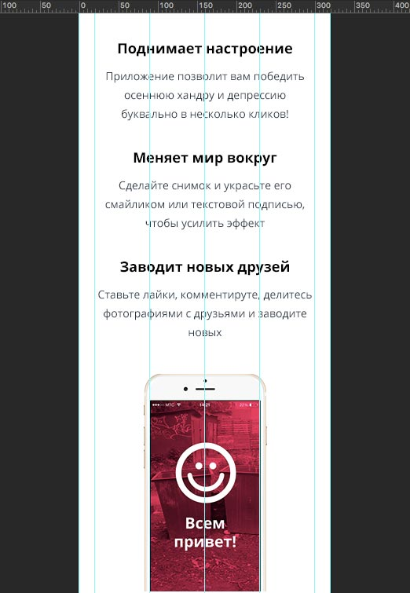
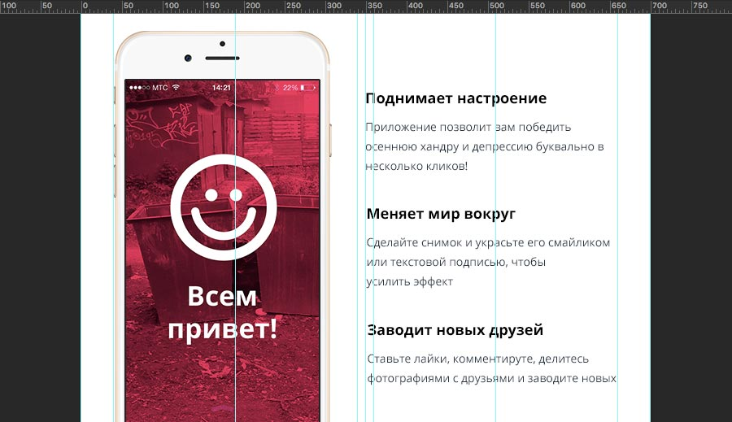
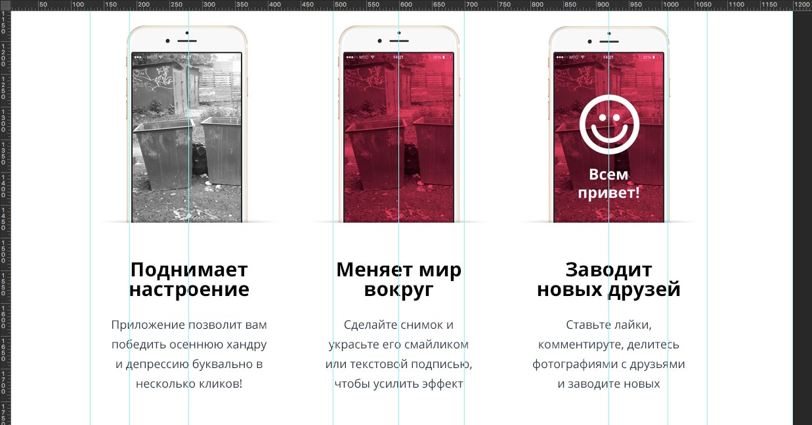

# Брейкпоинты и неизвестность между ними

Задача: даны макеты проекта мобильной, планшетной и десктопной версий. Требуется выполнить вёрстку, соответствующую макетам при соответствующих переходах вьюпортов:

- 320px — мобильная версия,
- 660px — планшетная версия,
- 960px — десктопная версия.





Это типовая формулировка задачи, которую обычно получают верстальщики. Однако редко оговаривается, как будет выглядеть вёрстка на экранах промежуточной ширины. Причины просты: на этапе дизайна фокус внимания дизайнера сосредоточен на конкретном размере экрана, а для создания иного размера недостаточно уменьшить окошко браузера, как при создании веб-страницы, нужно создавать новый макет.

Не будем «воевать» с дизайнером. Даны макеты, задача поставлена. Давайте рассмотрим, какие подходы для решения задачи существуют в CSS.

Сначала зафиксируем термины:

1. __Вьюпорт__ (_viewport_) — видимая часть окна браузера.
2. __Брейкпоинт__ (_breakpoint_) — значение ширины вьюпорта, точка перехода между различными версиями сайта (от мобильной версии к планшетной, от планшетной к десктопной).
3. __Контейнер__ (_container_) — блок, определяющий размеры контентной части сайта.

Основной контент страницы поместим в блок-контейнер, чтобы не мучаться с заданием ширины внутренним элементам:

```html
<div class="container">
  <!-- Тут будет наша классная разметка -->
</div>
```

Зададим базовые стили контейнеру, одинаковые для всех вариантов:

```css
.container {
  box-sizing: border-box;
  min-width: 320px;
  margin: 0 auto;
}
```

_Замечание: я специально установил `box-sizing: border-box;`, чтобы показать, как будут считаться значения. Я предпочитаю использовать `border-box` во всех элементах, задавая это свойство селектором `*` . Если вы используете иную боксовую модель, нужно пересчитать значения ширин и отступов._

## Фиксированный контейнер между брейкпоинтами.

Решение «в лоб»: величины выставляются в точном соответствии с макетом, промежуточные значения нас не интересуют.

Будем верстать по принципу [«сначала мобильные»](https://ru.wikipedia.org/wiki/%D0%90%D0%B4%D0%B0%D0%BF%D1%82%D0%B8%D0%B2%D0%BD%D1%8B%D0%B9_%D0%B2%D0%B5%D0%B1-%D0%B4%D0%B8%D0%B7%D0%B0%D0%B9%D0%BD#.D0.A1.D0.BD.D0.B0.D1.87.D0.B0.D0.BB.D0.B0_.D0.BC.D0.BE.D0.B1.D0.B8.D0.BB.D1.8C.D0.BD.D1.8B.D0.B5_.28.C2.ABMobile_first.C2.BB.29), поэтому зададим стили для мобильных устройств, одновременно являющимися и основными стилями контейнера:

```css
.container {
  width: 320px;
  padding: 0 20px;
}
```

Теперь планшетная версия:

```css
@media only screen and (min-width: 660px) {
  .container {
    width: 660px;
  }
}
```

И десктопная: 

```css
@media only screen and (min-width: 960px) {
  .container {
    width: 960px;
    padding: 0 10px;
  }
}
```

Давайте посмотрим на макет: всё ли хорошо? Ой, что это? 
Дизайн-макет планшетной версии имеет ширину **700px**, а в требованиях к заданию говорится про **660px**. Хм... 🤔 

Обсуждение таких несоответствий с дизайнером останется на вашей совести. Тем не менее ничего не мешает сверстать согласно макету и ТЗ. Давайте считать: 

Ширина дизайн-макета в планшетной версии — **700px**. Она складывается контентной части **620px** и отступов **40px + 40px**. 
Чтобы вёрстка соответствовала дизайну при ширине **660px**, нужно что-то сократить. Жертвовать шириной контентной части опасно — какие-то элементы могут не поместиться и сломать вёрстку. А вот отступы можно сократить c **40px** до **20px**. Получим `20 + 620 + 20 = 660`. Ура!

_Заметьте, что в стилях планшетной версии не указан `padding`, поскольку совпадает с основным._

Аналогичные вычисления применяются и к десктопной версии. Контентная ширина макета – **940px**. Чтобы попасть в соответствие на **960px**, уменьшим отступы: `10 + 940 + 10 = 960`. Таким образом, `padding` у контейнера равен **10px**.

Получился фиксированный контейнер: **[ДЕМО](https://rawgit.com/aalexeev239/articles/master/breakpoints/html/container-fixed.html)**.

## Резиновый контейнер между брейкпоинтами.

«Резиновая» вёрстка предполагает, что контент растягивается на всю доступную ширину. В этом случае нужно сконцентрироваться не на брейкпоинтах — точках перехода, а на интервалах между ними. 

Таким образом, мы принимаем за мобильную версию ширину экрана от 0 до 659px, планшетную — от 660px до 959px и десктопную — от 960px. Рассмотрим каждый из интервалов отдельно:

### Мобильный диапазон: от 0 до 659px

Хотя мы и рассматриваем ширину от **0**, минимальная ширина контента в данном случае — **320px**. Это согласуется с данными Google о [размерах устройств](https://material.io/devices/). Устройства меньшей ширины будут добавлять горизонтальную прокрутку. 

_Замечание: ограничение по минимальной ширине полезно, чтобы не сломать некоторые элементы интерфейса (например, горизонтальную навигацию). Если вам всё же нужно подготовить вёрстку для устройств меньшей ширины, снимите ограничение и адаптируйте контент._

Итак, резиновая вёрстка получит минимальную ширину **320px** и **100%** ширину на всём интервале. Не забудем и отступы:

```css
.container {
  min-width: 320px;
  padding: 0 20px;
}
```

Ширина `width: 100%;` блочному тегу устанавливается по умолчанию, поэтому явно прописывать это правило не нужно. Медиа-выражения для мобильной версии мы не указываем.

### Планшетный диапазон: от 660px до 959px

В этой версии рассуждения аналогичны случаю с фиксированным контейнером — из-за несоответствия требований задачи и дизайна мы пересчитываем размеры отступов, получаем отступы в **20px**. Поскольку эти отступы совпадают с мобильными, а 100%-ую ширину мы не указываем, для такой планшетной версии не нужно отдельного медиаусловия. 

```css
/*@media only screen and (min-width: 660px) {

  ¯\_(ツ)_/¯

}*/
```

Альтернативный вариант: можно оставить отступы по **40px**, а сам брейкпоинт изменить с **660px** до **700px**. Требования задачи формально будут выполнены — на экране **660pх** будет отображаться контейнер мобильной версии. Для экранов шириной **700px** и выше боковые отступы увеличатся до **40px**, что увеличит область, безопасную для прокрутки (прокручивая контент на тач устройствах, можно случайно попасть на кликабельный элемент). 

Будет ли отображение страницы лучше? Возможно, да, зависит от остального контента. Стили в этом случае будут такими:

```css
@media only screen and (min-width: 700px) {
  .container {
    padding: 0 40px;
  }
}

@media only screen and (min-width: 660px) {
  .another-block {/* ... */}
}
```


### Десктопный диапазон: от 960px

Применяем заклинание _Арифметикус Калкулус_ из прошлой секции и меняем значение боковых отступов:

```css
@media only screen and (min-width: 960px) {
  .container {
    padding: 0 10px;
  }
}
```

А как же будет отображаться сайт на экране большей ширины? 

Ответ в дизайн-макете: выбранная ширина — **1200px**, значит мы не хотим «резины» на десктопном разрешении. Смело фиксируем ширину:

```css
@media only screen and (min-width: 960px) {
  .container {
    padding: 0 10px;
    width: 960px;
  }
}
```

Можно поступить иначе: установить максимальную ширину изначально. Так стили будут более прозрачны:

```css
.container {
  max-width: 960px;
}

@media only screen and (min-width: 960px) {
  .container {
    padding: 0 10px;
  }
}
```

Получился резиновый контейнер: **[ДЕМО](https://rawgit.com/aalexeev239/articles/master/breakpoints/html/container-fluid.html)**.

## Смесь резинового и фиксированного контейнера.

Ради лучшего отображения страницы можно поэкспериментировать с подходами. Главная задача вёрстки — донести контент до пользователя в максимально удобном виде. Поработаем с шириной: оставим на мобильном разрешении резиновый контейнер до 480px, полностью резиновый контейнер для планшетов и фиксированный контейнер на десктопах.

```css
.container {
    max-width: 480px;
    padding: 0 20px;
  }

  @media only screen and (min-width: 660px) {
    .container {
        max-width: 960px;
    }
  }

  @media only screen and (min-width: 960px) {
    .container {
      max-width: 960px;
      padding: 0 10px;
    }
  }
```

**[ДЕМО](https://rawgit.com/aalexeev239/articles/master/breakpoints/html/container-mixed.html)**.

## Суровая реальность

Настало время сказать главное: перечисленные действия не отменяют обсуждение задачи с дизайнером / менеджером / заказчиком. В идеальном мире эта статья бесполезна, потому что все требования заранее описаны в _Максимально Подробной Спецификации_ :unicorn_face:. Обычно такой спецификации нет, поэтому наша задача — максимально подробно уточнить постановку ТЗ, объяснить коллегам тонкости отображения сайта на разных устройствах. И, по возможности, предложить решения.

Описанными выше способами возможные решения не ограничивается. Используйте различные подходы, комбинируйте `width`, `min-width` и `max-width`. Изучите медиа-выражения — они предоставляют [кучу возможностей](https://developer.mozilla.org/en-US/docs/Web/CSS/Media_Queries/Using_media_queries) управления стилями в зависимости от устройства: по ширине и высоте, ориентации экрана, разрешению, плотности пикселей и т.д. 

Принимайте во внимания особенности контента страницы и стандартные пользовательские устройства. Требуйте с менеджеров и заказчиков статистику заходов с различных устройств на ваш ресурс или аналогичные ему.

Адаптируйте ваши продукты под каждого пользователя. Больше спите и не засиживайтесь допоздна ;)
