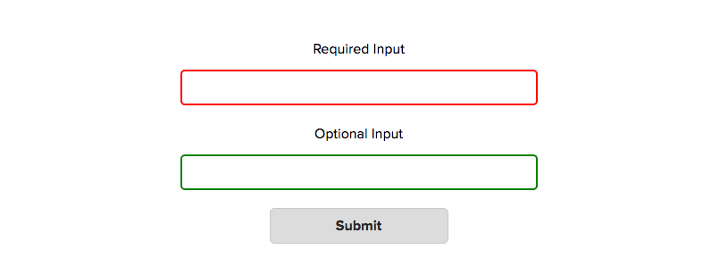
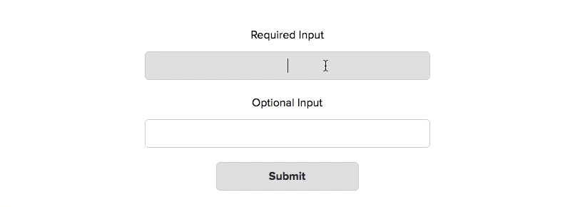
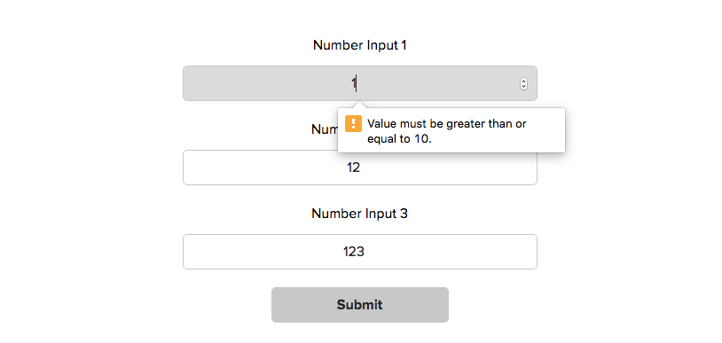
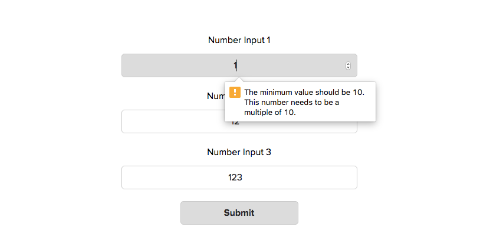
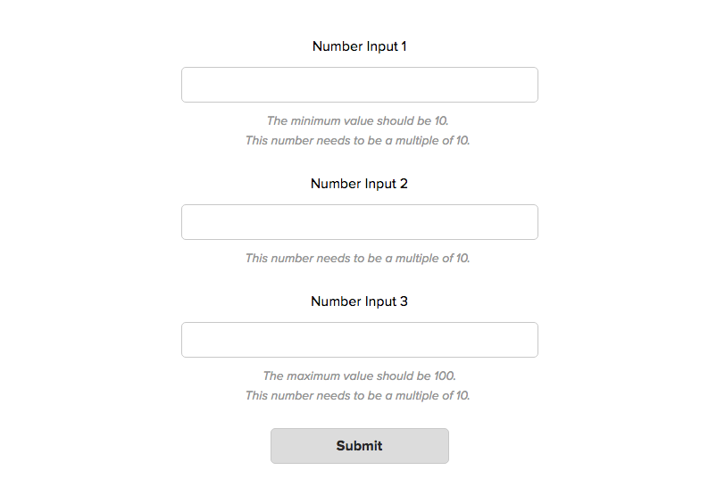
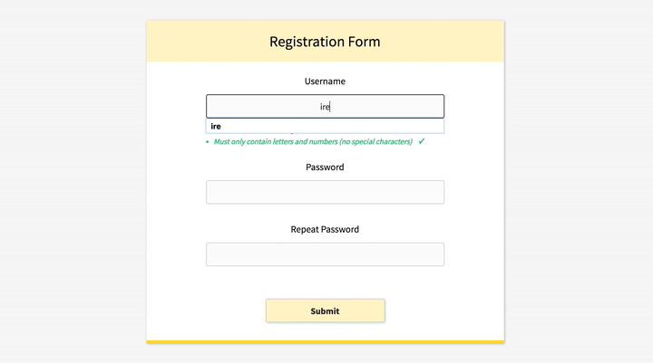

# Техники валидации форм

_Перевод оригинальной статьи [Form Validation Techniques](https://bitsofco.de/form-validation-techniques/), написанной Ire Aderinokun и опубликованной на [bitsofco.de](https://bitsofco.de/)._

Ни для кого не секрет, что онлайн-формы могут стать серьёзным испытанием для пользователей. Особенно когда они выглядят как список полей для ввода без каких-либо подсказок. Однако мы, как разработчики, можем значительно облегчить жизнь посетителям наших сайтов.

## Используем CSS

В CSS существует 4 специальных псевдокласса, применимых к  полям формы: `:valid` (_валидное поле_), `:invalid` (_невалидное_), `:required` (_обязательное_) и `:optional` (_необязательное_). Их можно использовать, чтобы добавлять некоторые — хотя и весьма ограниченные — подсказки пользователям, заполняющим форму.

Используя `:valid` и `:invalid`, мы можем показать пользователю, правильно ли заполнено поле по мере ввода.

```css
input:valid { border-color: green; }
input:invalid { border-color: red; }
```



Однако с этим способом связана одна проблема: стили применяются до того, как пользователь начнёт работу с формой. Поля, обязательные для заполнения, сразу подсветятся нам как `:invalid`, а необязательные — как `:valid`. Это значит, что пользователь, даже не приступив к заполнению формы, может сразу же получить негативную обратную связь. Не очень-то хорошо.

Стилизация состояний `:required` и `:optional` сама по себе не особо полезна, поскольку эта информация обычно указывается в подписях к полям формы. Однако мы можем объединить эти состояния с псевдоклассами `:valid` / `:invalid` и стилизовать их комбинации. Например, мы хотим показывать лишь положительный результат, когда валидно обязательное к заполнению поле.

```css
input:required:valid { border-color: green; }  
```



## Используем JavaScript

JavaScript даёт намного больше возможностей для улучшения работы пользователей с формами. Давайте рассмотрим в качестве примера три числовых поля, у каждого из которых установлен минимум в 10, максимум в 100 и шаг в 10 единиц.

```html
<form>
	<label>
		Number Input 1
	 <input type="number" min="10" max="100" step="10">
	</label>
	<label>
		Number Input 2
	 <input type="number" min="10" max="100" step="10">
	</label>
	<label>
		Number Input 3
	 <input type="number" min="10" max="100" step="10">
	</label>

	<input type="submit">
</form>
```

Устанавливая атрибуты `min`, `max` и `step`, мы можем быть уверены в правильности значения только тогда, когда пользователь использует специальные контролы числового поля. Но что мешает пользователю ввести вручную некорректные данные? Вот что произойдёт, если он вставит `1`, `12` и `123` в три поля и отправит форму:



В результате всё, что получит пользователь — это сообщение об ошибке для первого поля. Кроме того, в этом сообщении будет указано лишь одно несоответствие из двух требуемых. Такое поведение можно исправить, изменяя показываемые валидатором сообщения.

### Добавляем несколько сообщений об ошибках в один тултип

Валидируя поля, браузер проверяет их по определённому списку потенциальных ошибок. В каждом поле содержится специальный объект `validity`, включающий в себя список булевых значений, характеризующих ту или иную проверку на валидность. Например, вот такой `validity`-объект будет у поля, когда пользователь введёт в него `1`:

```js
input.validity = {  
	valid:false // Поле валидно
	customError:false // Установленно специальное сообщение ошибки
	patternMismatch:false // Значение не удовлетворяет шаблону, установленному в атрибуте pattern
	rangeOverflow:false // Значение превосходит атрибут max
	rangeUnderflow:true // Значение меньше атрибута min
	stepMismatch:true // Значение не соответствует указаному шагу
	tooLong:false // Значение слишком длинное
	tooShort:false // Значение слишком короткое
	typeMismatch:false // Значение не соответствует указаному атрибуту type
	valueMissing:false // Отсутствует обязательное значение
}
```

*Прим. переводчика*: Слово «mismatch» переводится как «несоответствие». Поэтому в значениях `patternMismatch`, `stepMismatch` и `typeMismatch` обратная логика: `true` — значение не удовлетворяет атрибуту, `false` — удовлетворяет.

По умолчанию браузер отобразит лишь одну ошибку. Что мы можем сделать, так это проверить все эти значения самостоятельно и, если найдутся ошибки, сохранить их. Как только мы сохраним все ошибки для одного поля, мы можем отобразить весь их список в виде специального сообщения об ошибке при помощи функции `setCustomValidity()`.

```js
function CustomValidation() { }
CustomValidation.prototype = {
	// Установим пустой массив сообщений об ошибках
	invalidities: [],

	// Метод, проверяющий валидность
	checkValidity: function(input) {

		var validity = input.validity;

		if ( validity.patternMismatch ) {
			this.addInvalidity('This is the wrong pattern for this field');
		}
		if ( validity.rangeOverflow ) {
			var max = getAttributeValue(input, 'max');
			this.addInvalidity('The maximum value should be ' + max);
		}
		if ( validity.rangeUnderflow ) {
			var min = getAttributeValue(input, 'min');
			this.addInvalidity('The minimum value should be ' + min);
		} 
		if ( validity.stepMismatch ) {
			var step = getAttributeValue(input, 'step');
			this.addInvalidity('This number needs to be a multiple of ' + step);
		}
		// И остальные проверки валидности...
	},

	// Добавляем сообщение об ошибке в массив ошибок
	addInvalidity: function(message) {
		this.invalidities.push(message);
	},

	// Получаем общий текст сообщений об ошибках
	getInvalidities: function() {
		return this.invalidities.join('. \n');
	}
};

// Добавляем обработчик клика на кнопку отправки формы
submit.addEventListener('click', function(e) {
	// Пройдёмся по всем полям
	for ( var i = 0; i < inputs.length; i++ ) {

		var input = inputs[i];

		// Проверим валидность поля, используя встроенную в JavaScript функцию checkValidity()
		if ( input.checkValidity() == false ) {

			var inputCustomValidation = new CustomValidation(); // Создадим объект CustomValidation
			inputCustomValidation.checkValidity(input); // Выявим ошибки
			var customValidityMessage = inputCustomValidation.getInvalidities(); // Получим все сообщения об ошибках
			input.setCustomValidity( customValidityMessage ); // Установим специальное сообщение об ошибке

		} // закончился if
	} // закончился цикл
});
```

Теперь при попытке отправить форму мы увидим вот это:



Стало лучше, поскольку теперь будут показываться все сообщения об ошибках, связанные с конкретным полем. Однако другая проблема всё ещё не решена: ошибки по-прежнему показываются лишь для первого поля.

Это ограничение валидации, устанавливаемое браузером. Чтобы его побороть, нам нужно пойти другим путём.

### Показываем все ошибки для всех полей.

Вместо того, чтобы использовать встроенный тултип, мы можем добавлять сообщения об ошибках напрямую в DOM. Таким образом, все ошибки будут выводиться рядом с соответствующим полем.

Этого можно добиться какой-то парой дополнительных строчек в нашем коде:

```js
CustomValidation.prototype.getInvaliditiesForHTML = function() {
    return this.invalidities.join('. <br>');
}

// Добавляем обработчик клика на кнопку отправки формы
submit.addEventListener('click', function(e) {
    // Пройдёмся по всем полям
    for ( var i = 0; i < inputs.length; i++ ) {

        var input = inputs[i];

        // Проверим валидность поля, используя встроенную в JavaScript функцию checkValidity()
        if ( input.checkValidity() == false ) {

            var inputCustomValidation = new CustomValidation(); // Создадим объект CustomValidation
            inputCustomValidation.checkValidity(input); // Выявим ошибки
            var customValidityMessage = inputCustomValidation.getInvalidities(); // Получим все сообщения об ошибках
            input.setCustomValidity( customValidityMessage ); // Установим специальное сообщение об ошибке


            // Добавим ошибки в документ
            var customValidityMessageForHTML = inputCustomValidation.getInvaliditiesForHTML();
            input.insertAdjacentHTML('afterend', '<p class="error-message">' + customValidityMessageForHTML + '</p>')
            stopSubmit = true;

        } // закончился if
    } // закончился цикл
    if ( stopSubmit ) { e.preventDefault(); }
});
```


Вот что происходит при клике на submit теперь:



### Используем нестандартные проверки валидности

Иногда встроенной в браузер валидации бывает недостаточно. Нам может понадобиться, чтобы вводимые данные удовлетворяли некоторым дополнительным правилам. Например, чтобы в текстовом поле требовалось указать особые символы.

Так как мы уже проверяем все возможные ошибки вручную в нашей функции `CustomValidation.prototype.checkValidity`, мы можем просто-напросто добавить туда ещё несколько проверок.

```js
CustomValidation.prototype.checkValidity = function(input) {

    // Тут идут встроенные проверки валидности ------

    // А тут специальные ------
    if ( !input.value.match(/[a-z]/g) ) {
        this.addInvalidity('At least 1 lowercase letter is required');
    }
    if ( !input.value.match(/[A-Z]/g) ) {
    this.addInvalidity('At least 1 uppercase letter is required');
    }
}
```

### Валидация в реальном времени

Хотя текущий способ выглядит намного лучше, он тоже не без изъянов. Наихудший из недочётов заключается в том, что пользователь не сможет увидеть никаких сообщений, пока не нажмёт на кнопку отправки формы. Было бы гораздо лучше, если бы валидация поля происходила сразу же при его заполнении. Можно выделить три правила для того, чтобы с формой было удобно работать:

1. Требования для каждого поля чётко видны до того, как пользователь начал печатать.
2. Как только пользователь начинает вводить данные, соблюдая требования, он сразу видит индикатор успешного заполнения поля или подсказки, если есть ошибки.
3. Нужно отображать сообщения об ошибках таким образом, чтобы пользователь не мог отправить некорректно заполненную форму.

В статье на следующей неделе ([оригинал](https://bitsofco.de/realtime-form-validation/), _перевод готовится_) я покажу, как реализовать валидацию в реальном времени, переделав вот такую простую форму регистрации:



Если вы хотите попробовать свои силы (и даже сделать получше), вы можете воспользоваться вот этим [шаблоном](http://codepen.io/ire/pen/ezZjgv).

_Перевод оригинальной статьи [Form Validation Techniques](https://bitsofco.de/form-validation-techniques/), написанной Ire Aderinokun и опубликованной на [bitsofco.de](https://bitsofco.de/)._

_Перевод [Андрея Алексеева](https://github.com/aalexeev239/), редактура [Елены Карякиной](https://github.com/CubiZm) и [Игоря Алексеенко](https://github.com/o0)._


