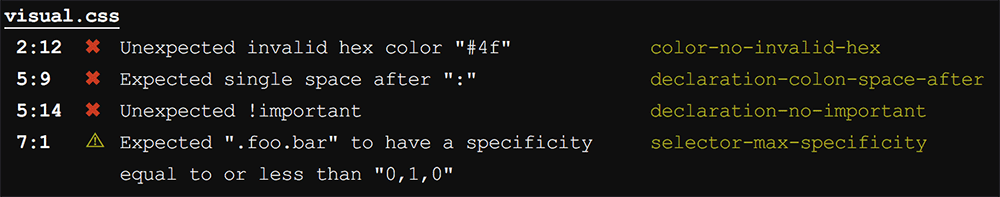
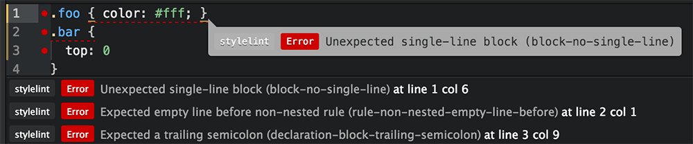

# Линтинг CSS с помощью stylelint

Перевод гостевого поста [Дэвида Кларка](http://davidtheclark.com/) на [CSS-Tricks](https://css-tricks.com/stylelint/). 

Дэвид — один из создателей [Stylelint](http://stylelint.io/) — инструмента, позволяющего навести порядок в CSS. Он написал превосходное вступление о том, зачем нужно линтить CSS.

Вы пишете CSS. Возможно, очень много. И вы допускаете ошибки. Возможно, тоже очень много. Миру нужен новый герой, который спасёт нас от ошибок в CSS!

Иногда ошибки могут иметь серьёзные последствия. А иногда это всего лишь небрежно написанный или чересчур запутанный код. Некоторые из опечаток поначалу кажутся незначительными (что, конечно, зависит от вашего темперамента), но, чем дальше растёт проект, тем серьёзней они становятся. Всё больше и больше людей марают руки о плохо написанный код, и это заставляет их писать странные вещи. В результате получается такое, что вы и в страшном сне не могли себе представить.

Да, вы стараетесь следить за собой. Ваши коллеги поддерживают вас и указывают на огрехи. Но все мы люди, поэтому и вы, и ваши коллеги когда-нибудь пропустите ошибку. И, когда-нибудь в будущем, вы столкнетесь с последствиями тех ошибок, что обнаружатся в CSS.

Признайтесь, на самом деле никто, ни вы, ни ваши коллеги, не любите говорить о своих ошибках. Это как-то нелепо. И некоторые договорённости (например, о едином форматировании кода) определённо помогли бы делу, но, когда дело доходит до ручных исправлений, они все кажутся чересчур дотошными. Более того, они могут продемонстрировать не лучшие качества ваших коллег, когда дело дойдет до исправления мелочей.

Ко всему прочему, гораздо лучше было бы исправлять работу сразу же, чем ожидать код-ревью, на котором выяснится, что вы продублировали какое-то объявление или должны почистить отступы. Немедленная реакция поможет вам быстро усвоить договорённости по написанию кода и тратить меньше времени, раздумывая, почему CSS не работает.

## Распознающий ошибки механизм — вот что нам нужно

Нам нужен надёжный, распознающий ошибки механизм, который понимает CSS и понимает наc: наши намерения, предпочтения, идеалы и слабости.

Конечно, как у всех подобных вещей, у такого механизма будут свои ограничения. Но эти ограничения будут отличаться от тех, которые стоят перед вами и вашими коллегами. Он будет предотвращать все ошибки, которые только сможет, и будет это делать последовательно и неустанно. Тем временем вы можете сосредоточиться на улучшении самого механизма, увеличивая его возможности и ослабляя ограничения. Если подобный проект будет открытый, CSS-разработчики со всего мира смогут сделать свой вклад, поделившись информацией о своих ошибках.

## CSS-разработчикам нужны линтеры, как и всем остальным

Программы, предотвращающие ошибки, называются «линтерами». Для Javascript уже есть несколько хороших линтеров. В частности, [ESLint](http://eslint.org/) просто творит чудеса, показывая всем нам, насколько хорош может быть линтер. Но в мире CSS всё было плохо — мы были ограничены несколькими вариантами: написанным на Ruby препроцессорным [scss-lint](https://github.com/brigade/scss-lint) и старым [CSS Lint](http://csslint.net/).

Но всё это было до прихода [PostCSS](http://postcss.org/). PostCSS, в числе прочего, помогает создавать _совместимые друг с другом инструменты работы с CSS_. Он может распарсить любой CSS-подобный синтаксис в Абстрактное Синтаксическое Дерево (AST, Abstract Syntax Tree — _прим. переводчика_), с которым в дальнейшем и работают плагины. При помощи [специальных парсеров](https://github.com/postcss/postcss#syntaxes) PostCSS может обрабатывать даже нестандартные, технически «невалидные» шаблоны (например, комментарии через `//`).

Таким образом, созрела почва для нового мощного CSS-линтера — основанного на PostCSS и вобравшего в себя лучшие стороны scss-lint и ESLint.

В этом проекте я работал с несколькими коллегами, и сейчас я хочу представить вам то, что мы создали — [stylelint](http://stylelint.io/).

## Несколько вещей, которые можно делать с помощью stylelint

То, что написано далее — попытка подытожить возможности stylelint. Он содержит более сотни правил и огромные возможности для расширения.

Если вы уже чувствуете нарастающее нетерпение («Хорошо, хорошо, я уже поверил, что stylelint невероятен. Не надо толочь воду в ступе!»), просто пропустите этот раздел. В следующем я отвечу на часто возникающие вопросы и дам несколько подсказок.

### #1) Находить ошибки

Некоторые правила Stylelint служат для обнаружения очевидных ошибок: опечаток или описок, сделанных, когда вы спешили или были невнимательны. Например, вы можете запретить пустые блоки в коде, неверные hex-значения, дублирующиеся селекторы, необъявленные анимации, неправильный синтаксис линейных градиентов.

Другие правила предназначены для отлова более сложных ошибок. Например, есть правило, которое срабатывает, когда вы использовали сокращенное написание свойства (например, `margin`), перекрывающее один из его развернутых вариантов (например, `margin-top`), хотя вы, скорее всего, не хотели этого. А ещё есть правило, которое срабатывает в такой  ситуации: представьте, что Правило А находится до Правила Б, однако при этом перезаписывает Правило Б, поскольку селектор у Правила А более специфичен (например, Правило А объявлено в `.foo.bar {...}`, а Правило Б в `.foo {...}`). Это вам не хухры-мухры. 

Ещё одно правило использует PostCSS-плагин [doiuse](https://github.com/anandthakker/doiuse), проверяя, будут ли ваши стили работать для всех браузеров, которые вы решили поддерживать. Другое правило использует [css-colorguard](https://github.com/SlexAxton/css-colorguard), чтобы сравнивать используемые в проекте цвета, и спрашивать вас, не стоит ли использовать единый цвет вместо нескольких похожих. (Вы уже заметили, что stylelint использует одно из главных преимуществ PostCSS? Довольно просто сделать правила, использующие результаты работы других PostCSS-плагинов).

### #2) Навязывать лучшие практики

Если вы следуете определённой методологии при работе со стилями или имеете определённый стиль кода, должна быть возможность не принимать некоторые конструкции кода. Stylelint предоставляет вам такие возможности.

Более того, вам нужно контролировать свои селекторы. Беспощадно. Используя stylelint, вы можете запретить селекторы, превышающие заданную специфичность, или, наконец, положить конец глубокой вложенности селекторов. Вы можете запретить использование некоторых категорий селекторов (например, id) и составить регулярные выражения, проверяющие, что селекторы следуют соглашениям по именованию.

Вы можете запретить использование `!important` или браузерных хаков, не относящихся к тем браузерам, что вы поддерживаете. Если вы используете [Автопрефиксер](https://github.com/postcss/autoprefixer) (что вы, пожалуй, должны делать), вы можете запретить использование браузерных префиксов в исходных файлах.

Если же вы хотите чего-то посерьёзнее, посвятите некоторое время настройкам, и вы сможете задавать порядок свойств в своих правилах, создавать черные и белые списки правил, значений, функций и единиц измерения.

### #3) Навязывать стиль написания кода

В stylelint есть куча правил, которые автоматически навязывают соглашения по стилю кода, так что ни вы, ни ваши коллеги не должны этим заниматься. Мы постарались сделать эти правила максимально _полными_ и невероятно _гибкими_.

Большинство из этих правил связаны с отступами. Однако, есть и такие, которые проверяют типы кавычек, постановку прописных и строчных символов, подстановку нуля в дробных значениях, использование сокращенных/полных правил и т.д.

Задумка в том, что вы с коллегами можете один раз договориться о стиле кода (например, «А давайте всегда ставить пробел после двоеточия в объявлениях правил»), занести это в конфигурацию stylelint и больше об этом не вспоминать. Пусть машины страдают за вас!

### #4) Настраивать и расширять всё что угодно

Nicholas Zakas, создатель ESLint (и также CSS Lint), [написал](https://www.nczonline.net/blog/2016/02/reflections-on-eslints-success/), что секрет успеха ESLint в его расширяемости. Stylelint следует примеру ESLint и старается быть настолько расширяемым, насколько это возможно.

Вы можете написать и опубликовать собственные правила в качестве плагинов. Уже доступно [некоторое количество](https://www.npmjs.com/browse/keyword/stylelint-plugin), и нам не терпится узнать, что ещё придумает сообщество.

Конфигурации можно расширять, и, следовательно, ими можно делиться. Мы переняли это у ESLint, как и плагины. [Здесь](https://www.npmjs.com/browse/keyword/stylelint-config) вы можете посмотреть уже опубликованные конфигурации, и в числе прочих — конфигурации от WordPress и SUITCSS.

Если вам не нравятся встроенные в stylelint инструменты вывода, вы можете создать собственные, и даже адаптировать их для вашей организации. Также вы можете настроить оповещения, выводимые правилами.

Используя API stylelint, вы можете создавать плагины для текстовых редакторов и менеджеров задач, встраивающие stylelint в каждую ступень рабочего процесса.

И, если вам придёт в голову, как ещё можно использовать stylelint, дайте нам знать!

## Ответы на часто задаваемые вопросы

Где-то в недрах вашего сознания, должно быть, уже появились вопросы. Вот ответы на самые частые из тех, что нам обычно задают:

### Могу ли я использовать stylelint вместе с SCSS или Less?

Да, вы можете использовать stylelint вместе с SCSS! И совсем недавно появилась поддержка Less. Так как PostCSS позволяет использовать [специальные парсеры](https://github.com/postcss/postcss#syntaxes), у stylelint нет проблем с нестандартным синтаксисом — всё, для чего можно написать PostCSS-парсер, можно прогнать через stylelint.

На данный момент существуют следующие PostCSS-парсеры — и, следовательно, поддержка stylelint — [SCSS](https://github.com/postcss/postcss-scss), [Less](https://github.com/webschik/postcss-less), новый [SugarSS](https://github.com/postcss/sugarss). Если вы хотите поддерживать иной специальный синтаксис, помогите с написанием PostCSS-парсера к нему!

Stylelint старается охватить все возможные варианты написания: одни люди используют стандартный CSS-синтаксис, другие — расширения, вроде SCSS, третьи — странные специальные свойства. Конечно, некоторые правила могут сломаться,  если вы используете нестандартный синтаксис (например, `#{$interpolation}` из Sass и правило про id в селекторах). Конечно, когда мы находим такие ошибки, мы с ними разбираемся. Но, тем не менее, вы сами можете выключить любое правило, как полностью, так и пофайлово, и построчно.

### Могу ли я использовать stylelint с будущим CSS-синтаксисом?

Да! Как и в ответе выше: stylelint может разобрать всё, что понимает PostCSS, в том числе и будущий CSS-синтаксис (который вы используете, скорее всего, при помощи PostCSS-плагинов). Честно говоря, некоторые из правил stylelint как раз нацелены на будущий CSS, такие, как `range` и `custom properties`.

### Конфигурация stylelint может быть огромной. С чего лучше начать?

Мы рекомендуем создать конфигурацию одним из трёх способов:

- Вы можете взять уже опубликованную конфигурацию и расширить её. Мы создали и поддерживаем [stylelint-config-standard](https://github.com/stylelint/stylelint-config-standard), как некую основу, подходящую большинству пользователей. А ещё [можно найти](https://www.npmjs.com/browse/keyword/stylelint-config) довольно много других конфигураций.
- Начните с чистого листа и добавляйте по одному правилу. Изначально все правила выключены, поэтому, добавляя одно правило за другим, вы точно знаете, что делает каждое. Вы будете понимать каждое своё правило и уметь их настраивать.
- Скопируйте [стартовую конфигурацию](http://stylelint.io/user-guide/example-config/) и решите, какие опции использовать, а какие правила убрать.

К счастью, вы не должны писать огромные stylelint-конфигурации раз за разом. Создайте ту, что удовлетворяет всем вашим требованиям, и используйте её везде.

### Как проще всего использовать stylelint?

Самый простой способ использовать stylelint — через его [CLI](http://stylelint.io/user-guide/cli/).

Если вы предпочитаете Gulp-плагин, для вас есть [gulp-stylelint](https://github.com/olegskl/gulp-stylelint). Также есть [вариант](https://github.com/vieron/stylelint-webpack-plugin) для webpack. Мы надеемся, что они вдохновят людей разработать плагины и для других менеджеров задач, например для Grunt. (Кстати, простая задачка для open source работы, если вы ищете такую!).

Вы также можете использовать stylelint как PostCSS-плагин, включая его в любую цепочку плагинов. Иными словами, _вы можете использовать stylelint везде, где [можно запустить PostCSS](https://github.com/postcss/postcss#runners)_ — то есть практически в любом инструменте сборки!

Кроме того, уже существуют плагины для текстовых редакторов Atom, Sublime Text и VS Code, предоставляющие более быструю реакцию на ваш код. Всё это собрано на нашей странице [Complementary Tools](http://stylelint.io/user-guide/complementary-tools/).

Вот как это может выглядеть в командной строке:

А вот так это выглядит в Atom:

### Будет ли stylelint исправлять мои ошибки?

Нет, но для этого существует другой проект, называемый [stylefmt](https://github.com/morishitter/stylefmt). Он берёт конфигурацию stylelint — точно такую, как у вас — и исправляет всё, что только может исправить. Мы надеемся, что при помощи сообщества stylefmt вырастет настолько, что сможет исправлять все нарушения, которые можно исправить автоматически. [Помогите](https://github.com/morishitter/stylefmt/issues) ему достичь этого!

Кроме того, вы можете использовать и другие инструменты вместе со stylelint, например [CSScomb](http://csscomb.com/) или [perfectionist](https://github.com/ben-eb/perfectionist) (или [postcss-sorting](https://github.com/hudochenkov/postcss-sorting), _прим. переводчика_), автоматически исправляя одно и показывая другое.

## Дисциплинируйте себя при помощи линтинга

Существует невероятное количество правил написания CSS. Все мы знаем, что очень просто написать плохой CSS, поэтому мы и уделяем так много времени разговорам о методологиях (SMACSS, ACSS, BEM, SUITCSS,и т.д.). Вы должны выбрать стратегию и упорно придерживаться её. Если, конечно, вы не хотите писать код, от которого будете морщиться уже через неделю.

Амбициозная цель stylelint — автоматизировать правила написания кода. Это позволит создать некий костяк правил и инфраструктуру, которые CSS-разработчики смогут внедрить в работу, чтобы улучшить свои собственные практики.

Попробуйте stylelint и расскажите нам о своих впечатлениях. Если у вас есть идеи по его улучшению — вперёд! Дополняйте наш код правилами, расширениями, тестами, багфиксами, документацией, новыми идеями или же просто обратной связью. У нас всегда найдётся работа для разработчиков любого уровня.
