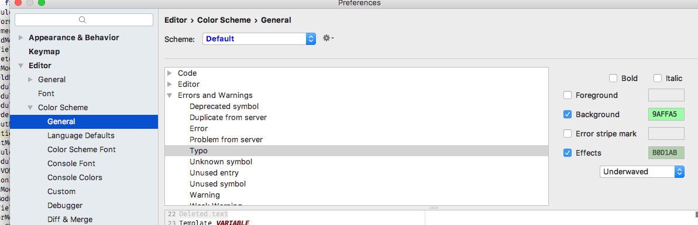
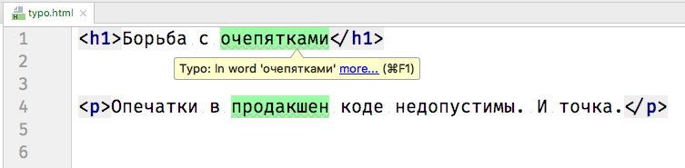
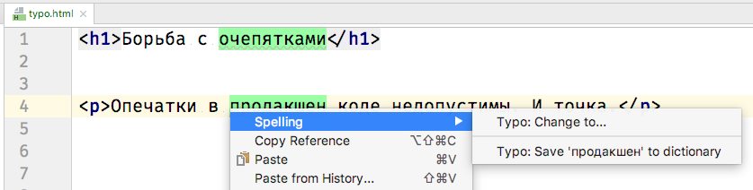

# Проверка орфографии в WebStrom

1. Скачайте [русский словарь](https://drive.google.com/open?id=19mgkkr2D0FESLTeYXgwLCloi2S5tj3SX)
2. Положите его в какую-нибудь директорию. Например `~/Desktop/dictionaries`
3. Установите эту директурию в настройках WS `Settings > Spelling > Dictionaries > Custom Dictionaries Filder`. [Инструкция от WebStorm](https://www.jetbrains.com/help/webstorm/spellchecking.html#configuring-dictionaries) вам в помощь.
4. Для пущей крутости установите подсветку ошибок `Settings > Editor > Color Scheme > Typo`.

---

Вуаля!

---

P.S. Если в словаре нет нужных слов, их можно добавить:

